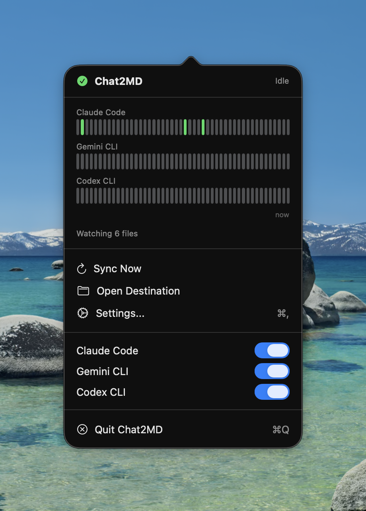
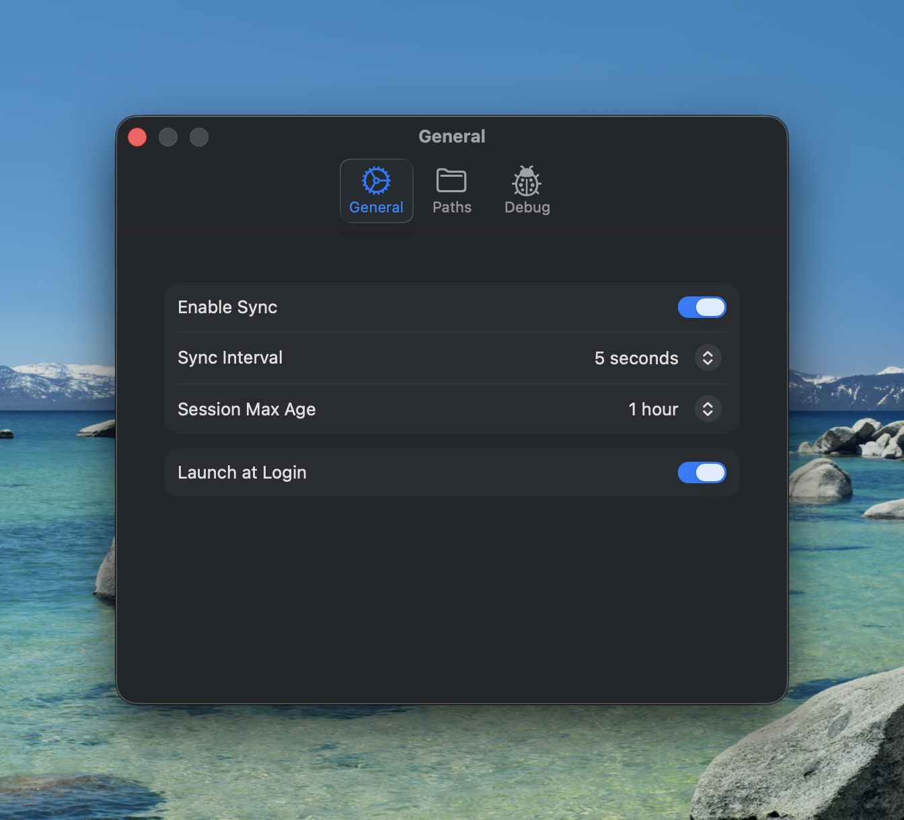
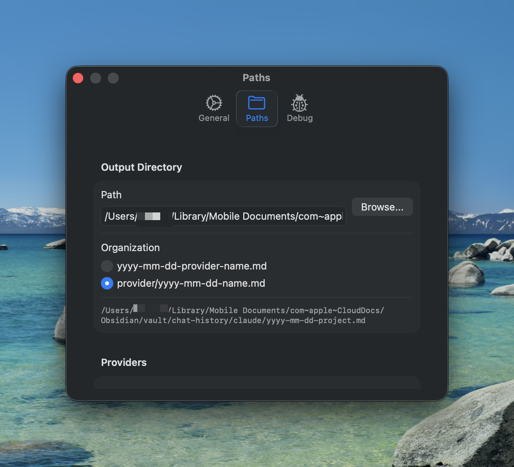
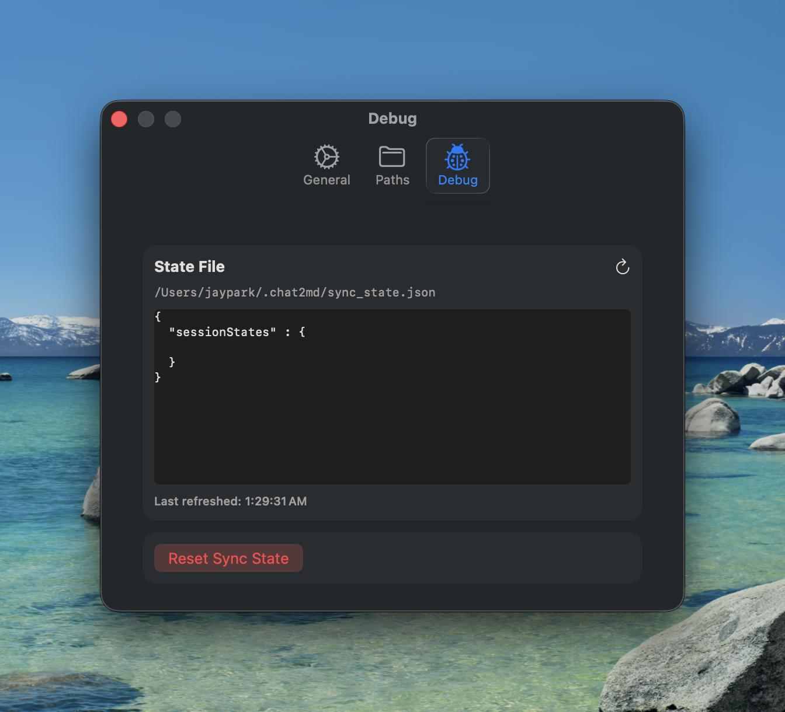

# Chat2MD

A macOS menu bar app that syncs AI CLI conversations to Markdown files for use with [Obsidian](https://obsidian.md) or any markdown-based note system.

## Supported Providers

| Provider | Path | Status |
|----------|------|--------|
| [Claude Code](https://code.claude.com/docs/en/overview) | `~/.claude/projects` | ✅ Full support |
| [Gemini CLI](https://github.com/google-gemini/gemini-cli) | `~/.gemini/tmp` | ✅ Full support |
| [Codex CLI](https://github.com/openai/codex) | `~/.codex/sessions` | ✅ Full support |

## Features

- **Multi-Provider Sync**: Supports Claude Code, Gemini CLI, and Codex CLI
- **Automatic Sync**: Periodically syncs new conversations (configurable interval: 5s - 5min)
- **Incremental Updates**: Only syncs new messages, not entire conversations
- **YAML Frontmatter**: Metadata for Obsidian (date wikilink, provider, project, session, cwd)
- **Smart Optimization**: Uses folder modification time to skip unchanged directories
- **Menu Bar Toggles**: Enable/disable each provider without opening Settings
- **Launch at Login**: Optionally start automatically when you log in
- **Status Graph**: Visual history of recent sync operations per provider
- **Debug View**: Inspect sync state and troubleshoot issues

## Screenshots

### Claude Code → Obsidian


### App UI









## Installation

### Requirements
- macOS 14.0 (Sonoma) or later
- At least one supported CLI installed (Claude Code, Gemini CLI, or Codex CLI)

### Download
1. Download `Chat2MD-v1.1.0.zip` from [Releases](https://github.com/jayjongcheolpark/chat2md/releases)
2. Extract and move `Chat2MD.app` to `/Applications`
3. **Important**: The app is not notarized, so you need to bypass Gatekeeper:

   **Option A** (Recommended):
   - Open **System Settings → Privacy & Security**
   - Scroll down to find `"Chat2MD.app" was blocked`
   - Click **Open Anyway**

   **Option B** (Terminal):
   ```bash
   xattr -cr /Applications/Chat2MD.app
   open /Applications/Chat2MD.app
   ```

### Build from Source
1. Clone this repository
2. Open `Chat2MD.xcodeproj` in Xcode
3. Build and run (⌘R)

## Configuration

### Paths
| Setting | Default | Description |
|---------|---------|-------------|
| Output Directory | `~/...obsidian/Documents/vault/claude` | Where to save markdown files |
| Claude Code | `~/.claude/projects` | Claude Code session files |
| Gemini CLI | `~/.gemini/tmp` | Gemini CLI session files |
| Codex CLI | `~/.codex/sessions` | Codex CLI session files |

### Sync Options
| Setting | Default | Description |
|---------|---------|-------------|
| Sync Interval | 5 seconds | How often to check for new messages |
| Session Max Age | 1 hour | Only sync sessions modified within this time |

## Status Graph Colors

| Color | Meaning |
|-------|---------|
| 🟢 Green | Sync successful (new messages synced) |
| 🔴 Red | Sync failed (error occurred) |
| ⚫ Gray | Skipped (no new messages) |
| ⬜ Light Gray | No data |

## How It Works

1. Scans enabled provider directories for session files
2. Resolves project names from provider-specific metadata
3. Extracts new messages since last sync
4. Creates session-based markdown files with YAML frontmatter

### Sync Optimization

The app uses smart optimization to minimize disk I/O:

**Cold Start** (first sync after app launch, state reset, or re-enable):
- Fetches all conversations from **today** (since midnight)
- Ensures no conversations are missed after downtime

**Warm Sync** (continuous operation):
- Only checks files modified within **Session Max Age** (default: 1 hour)
- Skips folders whose modification date is older than cutoff
- Significantly reduces scanning for large session directories

**Folder-level Optimization**:
| Provider | Strategy |
|----------|----------|
| Claude Code | Skip project folders not modified since cutoff |
| Gemini CLI | Skip hash folders not modified since cutoff |
| Codex CLI | Skip only leaf folders (DD in YYYY/MM/DD structure) |

**Incremental Parsing**:
- Tracks last synced line number per session file
- Only parses new lines added since last sync
- Skips files not modified since last sync timestamp

## Output Format

### File Organization
**Flat mode** (default):
```
vault/2026-02-01-claude-chat2md-7f5bb80b.md
vault/2026-02-01-gemini-1490b1b4-64aec3c1.md
vault/2026-02-01-codex-chat2md-9750ef13.md
```

**Subfolder mode**:
```
vault/claude/2026-02-01-chat2md-7f5bb80b.md
vault/gemini/2026-02-01-1490b1b4-64aec3c1.md
vault/codex/2026-02-01-chat2md-9750ef13.md
```

### File Content
```markdown
---
date: "[[2026-02-01]]"
provider: claude
project: chat2md
session: 7f5bb80b
cwd: /Users/name/Developer/chat2md
---

**User**:
Your question here

**Claude Code**:
Response here

| Tables | Work | Too |
|--------|------|-----|
| data   | data | data|
```

## File Locations

| File | Location | Purpose |
|------|----------|---------|
| Sync State | `~/.chat2md/sync_state.json` | Tracks last synced line per session |
| App Settings | macOS UserDefaults | Stores user preferences |

## Troubleshooting

### Messages are missing or duplicated
1. Go to Settings → Debug
2. Click "Reset Sync State"
3. Delete existing markdown files if needed
4. Sync will restart from scratch

### Tables not rendering correctly
Ensure there's a blank line before tables in your markdown viewer. Chat2MD automatically adds this.

### Project name is wrong
The app uses the `projectPath` from Claude's `sessions-index.json`. The last folder name is used as the project name.

## Development

### Project Structure
```
Chat2MD/
├── App/
│   ├── Chat2MDApp.swift        # App entry point
│   └── AppDelegate.swift       # Menu bar setup
├── Models/
│   ├── ClaudeMessage.swift     # Claude JSONL parsing
│   ├── GeminiMessage.swift     # Gemini JSON parsing
│   ├── CodexMessage.swift      # Codex JSONL parsing
│   ├── SessionMetadata.swift   # Frontmatter metadata
│   ├── Settings.swift          # User preferences
│   ├── SyncState.swift         # Sync progress tracking
│   └── SyncHistory.swift       # Sync history entries
├── Providers/
│   ├── Provider.swift          # Provider protocol
│   ├── ProviderType.swift      # Provider enum
│   ├── ProviderRegistry.swift  # Provider management
│   ├── ClaudeProvider.swift    # Claude Code implementation
│   ├── GeminiProvider.swift    # Gemini CLI implementation
│   └── CodexProvider.swift     # Codex CLI implementation
├── Services/
│   ├── SyncService.swift       # Main sync logic
│   ├── MarkdownConverter.swift # Convert to markdown
│   └── LaunchAgentManager.swift # Login item management
└── Views/
    ├── MenuBarView.swift       # Menu bar UI
    ├── SettingsView.swift      # Settings window
    └── StatusGraphView.swift   # Sync status graph
```

## License

MIT License

## Acknowledgments

- Built for use with [Claude Code](https://code.claude.com/docs/en/overview) by Anthropic
- Designed for [Obsidian](https://obsidian.md) markdown workflows
